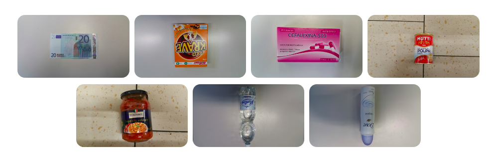

# Waste datasets review

List of datasets with any kind of litter, garbage, waste and trash. Created during the [detectwaste.ml](https://detectwaste.ml/) project

Today, more than 300 million tons of plastic are produced annually. Plastic is everywhere and we constantly use it in our daily life.

The idea of **detect waste project** is to use Artificial Intelligence to detect plastic waste in the environment. Our solution will be applicable for video and photography. Our goal is to use AI for Good.

**Visit [majsylw/litter-detection-review](https://github.com/majsylw/litter-detection-review) to see broader review of papers, projects and other resources concering the problem of litter in an environment.**

## Contributing

Feel free to add **issue** with short description of new dataset or create a **pull request** - add the new dataset to the table or fill missing description.

# Summary

| Name                               	| No. categories 	| No. subcategories              	| No. images 	| Annotation                	| Comment                              	| Website                                                             	| License | Description        	|
|------------------------------------	|----------------	|--------------------------------	|------------	|---------------------------	|--------------------------------------	|---------------------------------------------------------------------	|-------- | --------------------	|
| TrashCan 1.0                       	| 3              	| 34                             	| 7 212      	| Instance-Segmentation     	| Underwater images                    	| [website](https://conservancy.umn.edu/handle/11299/214865)                     	| Free for academic teaching/research use, must obtain JAMSTEC permission for commercial use.  | :heavy_check_mark: 	|
| Trash-ICRA19                       	| 3              	| 34                             	| 5 700      	| Detection                 	| Underwater images                    	| [website](https://conservancy.umn.edu/handle/11299/214366)                     	| Free for academic teaching/research use, must obtain JAMSTEC permission for commercial use.  | :heavy_check_mark: 	|
| TACO                               	| 28             	| 60                             	| 1 500      	| Segmentation              	| Waste in the wild                    	| [website](http://tacodataset.org/stats)                                        	| MIT license | :heavy_check_mark: 	|
| TACO bboxes                        	| 7              	| 60                             	| WIP        	| Detection                 	| Waste in the wild                    	| WIP                                                                 	| ? | :heavy_check_mark: 	|
| UAVVaste                           	| 1              	| -                              	| 772        	| Segmentation              	| Drone dataset                        	| [github](https://github.com/UAVVaste/UAVVaste)                                	| Apache license | :heavy_check_mark: 	|
| Trashnet                           	| 6              	| -                              	| 2 527      	| Classification            	| Clear background                     	| [github](https://github.com/garythung/trashnet)                               	| MIT license | :heavy_check_mark: 	|
| WaDaBa                             	| 8              	| color,size, shape, or material 	| 4 000      	| Classification            	| Plastic dataset, clear background    	| [website](http://wadaba.pcz.pl/)                                               	| ? | :heavy_check_mark: 	|
| GLASSENSE-VISION                   	| 7              	| 136                            	| 2 000      	| Classification            	| Home-supplies, clear background      	| [website](http://www.slipguru.unige.it/Data/glassense_vision/)                 	| ? | :heavy_check_mark: 	|
| Waste Classification data          	| 2              	| -                              	| ~25 000    	| Classification            	| Scraped from google search           	| [kaggle](https://www.kaggle.com/techsash/waste-classification-data)           	| CC BY-SA 4.0 | :heavy_check_mark: 	|
| Waste Classification Data v2       	| 3              	| -                              	| ~27 500    	| Classification            	| Scraped from google search           	| [kaggle](https://www.kaggle.com/sapal6/waste-classification-data-v2)          	| CC BY-SA 4.0 | :heavy_check_mark: 	|
| Waste Images from Sushi Restaurant 	| 16             	| -                              	| 500        	| Classification            	| Clear background                     	| [kaggle](https://www.kaggle.com/arthurcen/waste-images-from-sushi-restaurant) 	| Database: Open Database, Contents: © Original Authors | :heavy_check_mark: 	|
| Open litter map                    	| 11             	| 187                            	| > 100k     	| Multilabel classification 	| Waste in the wild                    	| [website](https://openlittermap.com/)                                          	| ? | :heavy_check_mark: 	|
| Litter                             	| 24             	| size, shape, or material       	| ~14 000    	| Detection                 	| Waste in the wild, paid license      	| [website](https://www.imageannotation.ai/litter-dataset)                       	| ? | :heavy_check_mark: 	|
| Drinking Waste Classification      	| 4              	| -                              	| 9640       	| Detection                 	| Clear background, (cans and bottles) 	| [kaggle](https://www.kaggle.com/arkadiyhacks/drinking-waste-classification)   	| CC0: Public Domain | :heavy_check_mark: 	|
| waste_pictures                     	| 34             	| -                              	| ~24 000    	| Classification            	| Scraped from google search           	| [kaggle](https://www.kaggle.com/wangziang/waste-pictures)                     	| Unknown | :heavy_check_mark: 	|
| spotgarbage                        	| 3              	| -                              	| ~2 400     	| Classification            	| Scraped from Bing search           	| [kaggle](https://www.kaggle.com/apremeyan/garbage)  [github](https://github.com/spotgarbage/spotgarbage-GINI)                            	| CC0: Public Domain | :heavy_check_mark: 	|
| DeepSeaWaste                       	| 5              	| -                              	| 3 055      	| Classification            	| Underwater images                    	| [kaggle](https://www.kaggle.com/henryhaefliger/deepseawaste)                  	| Unknown | :heavy_check_mark: 	|
| MJU-Waste v1.0                      | 1              	| -                              	| 2475      	| Segmentation            	  | Plain background, indoor RGBD images                    	| [github](https://github.com/realwecan/mju-waste/)                  	| MIT license | :heavy_check_mark: 	|
| Domestic Trash Dataset                  | 10              | -                              	| > 9000      | Classification/Detection    | Waste inn the wild, paid license, 250 images for free                    	|  [github](https://github.com/datacluster-labs/Datacluster-Datasets)                 	| ? | :heavy_check_mark: 	|
| Cigarette butt dataset              | 1              	| -                              	| 2200      	| Detection            	      | Waste inn the wild, synthetic images                    	|  [website](https://www.immersivelimit.com/datasets/cigarette-butts)                 	| Non-Commercial, Educational License Agreement | :heavy_check_mark: 	|
| TrashBox | 7 | 25 | 17785 | Classification/Detection | Scraped from web | [github](https://github.com/nikhilvenkatkumsetty/TrashBox) | ? | :heavy_check_mark: |
| PortlandStateSingh | 5 | - | 11500 | Classification/Detection | Original photos | [website](https://web.cecs.pdx.edu/~singh/rcyc-web/index.html) | ? | |
| TIDY | 9 | - | 304 | Classification | Original photos | [github](https://github.com/gale31/TIDY) | MIT license | |

# Description

## TrashCan 1.0

An Instance-Segmentation Labeled Dataset of Trash Observations

7212 images under 3 main categories: bio, trash, unknown.
Categories:
* bio = turtle, squid, lobster, unknown, jellyfish, stingray, shrimp, crawfish, octopus, shark, shell, crab, starfish, eel
* trash = clothing, pipe, bottle, bag, snack_wrapper, glove, tire, can, cup,container, branch, wreakage, tarp, box, hose, rope, hay, net, paper, bucket, wire
* unknown
**Download**: Directly from website  https://conservancy.umn.edu/handle/11299/214865

## Trash-ICRA19:
A Bounding Box Labeled Dataset of Underwater Tras
5,700 underwater images extracted from video
https://jungseokhong.github.io/

**Download**: Directly from website https://conservancy.umn.edu/handle/11299/214366

## TACO
Open dataset with 1500 images from 28 categories and 60 detailed sub-categories of waste in the wild. Annotations available in COCO-json.

**Download**: Directly from website http://tacodataset.org/

## TACO bboxes
Additional hand-labelled annotations for images from TACO dataset.  There are seven recognized waste categories:
* bio: food waste such as fruit, vegetables, herbs, used paper towels and
tissues,
* glass: glass objects such as glass bottles, jars, cosmetics packaging,
* metals and plastic: scrap metal and non-ferrous metal, beverage cans,
plastic beverage bottles, plastic shards, plastic food packaging, or
plastic straws,
* non-recyclable: residual rubbish such as disposable diapers, pieces of
string, polystyrene packaging, polystyrene elements, blankets,
clothing, or used paper cups,
* other: construction and demolition, large-size waste (e.g. tires), used
electronics and household appliances, batteries, paint and varnish
cans, or expired medicines,
* paper: paper, cardboard packaging, receipts, newspapers, catalogues,
and books,
* unknown waste: (highly decomposed and hard-to-recognize litter),
* and extra class background label without any litter: a sidewalk, a
forest path, a lawn

Read more about it in the paper [Deep learning-based waste detection in natural and urban environments,](https://www.sciencedirect.com/science/article/pii/S0956053X21006474?dgcid=coauthor#fn1).

**Download**: Directly from [detect waste repository](https://github.com/wimlds-trojmiasto/detect-waste/tree/main/annotations)

## UAVVaste
**Drone rubbish detection intelligent technology**
The UAVVaste dataset consists to date of 772 images and 3716 annotations. The main motivation for creation of the dataset was the lack of domain-specific data. The datasets that are widely used for object detection evaluation benchmarking. The dataset is made publicly available and is intended to be expanded.

Avaiable annotations for Detection and Segmentation https://github.com/UAVVaste/UAVVaste

**Download**: Directly from annotations json on github https://github.com/UAVVaste/UAVVaste

## Trashnet
The dataset spans six classes: glass, paper, cardboard, plastic, metal, and trash. Currently, the dataset consists of 2527 images:

* 501 glass
* 594 paper
* 403 cardboard
* 482 plastic
* 410 metal
* 137 trash

**Download**: Directly from github https://github.com/garythung/trashnet

also is known as **Garbage Classification Data**

The Garbage Classification Dataset contains 2467 images from 6 categories: cardboard (393), glass (491), metal (400), paper(584), plastic (472) and trash(127).

**Download**: Directly from kaggle https://www.kaggle.com/asdasdasasdas/garbage-classification

## Plastic Waste DataBase of Images – WaDaBa
4000 images with detailed description of a plastic type (PET, PP, PE-HD...), object color, deformation level, dirtiness  and others. [classification]

The object were put on the research position and next photographed with first and second type of light. There were series carried out of 10 photographs with differ in the angle of the turnover for every object (in the vertical axis). Next the object was damaged to varying degrees: small, medium and large. For each type of destruction have been made 10 photographs. So considering all variants for every object 40 photographs were taken, multiplying it by the number of objects, 4 000 of photographs were created in the database.

**Download**:  Images free-to-download directly from website. Annotations available after signing license http://wadaba.pcz.pl/#download

## GLASSENSE-VISION
Home-supplies classification. It is not strict litter dataset but it gathers over 2000 images with objects well-spareted from background. Covers 7 main categories of (Banknotes, Cereals, Medicines, Cans, Tomato sauces, Water bottle, Deodorant stick) and 136 subcategories.

Glassense-Vision is a set of data we acquired and annotated to the purpose of providing a quantitative and repeatable assessment of the proposed method. The dataset includes 7 different use cases, meaning different object categories, where for each one of them we provide training (reference images used also to build dictionaries) and test images. All images in the dataset are manually annotated. The different use cases (object categories) can be grouped in three main geometrical types:

**Download**: http://www.slipguru.unige.it/Data/glassense_vision/

## Waste Classification data
Over 25k images already divided into training data - 22564 images and test data - 2513 images. Two main categories: Organic and recyclable

**Download**: Directly from kaggle https://www.kaggle.com/techsash/waste-classification-data

## Waste Classification Data v2
A variation about the **Waste Classification data**: extended by the new category "N" - Nonrecyclable added.

Over 25k images already divided into training data - 22564 + 2508 (N) images and test data - 2513 images + new 397 from category nonrecyclable. Three main categories: Organic (O) and recyclable  (R), and nonrecyclable (N). TRAIN folder contains 2508 images in the "N" directory.
The TEST folder contains 397 images in the "N" directory.

**Download**: Directly from kaggle https://www.kaggle.com/sapal6/waste-classification-data-v2

## Open litter map
The biggest dataset with over 100k images in total with 11 main categories and 187 subcategories.[multilabel] [classification]
https://openlittermap.com/

**Download**: Only from json with scraper -  [detectwaste scraper](https://github.com/wimlds-trojmiasto/detect-waste)

## Litter

The Litter dataset contains 14k images with 20k annotations (bounding boxes) and 24 classes. Each class represents an object (cup), while subclasses determine its size, shape, or material (long paper cup/short paper cup).

**Download**: After buying a license https://www.imageannotation.ai/litter-dataset

## Drinking Waste Classification
The dataset contains ~10k images grupped by 4 classes of drinking waste: Aluminium Cans, Glass bottles, PET (plastic) bottles and HDPE (plastic) Milk bottles. Pictures were taken with 12 MP phone camera as a part of final year Individual Project at University College London.
The dataset used parts of manually collected images from TrashNet.

**Download**: Directly from kaggle https://www.kaggle.com/arkadiyhacks/drinking-waste-classification

## waste_pictures
The dataset contains ~24k images grupped by 34 classes of waste for classification purposes. The images were divided into train and test subsets.

**Download**: Directly from kaggle https://www.kaggle.com/wangziang/waste-pictures

## spotgarbage - GINI dataset

The Garbage in Images (GINI) dataset with 2561 images with unspecified resolution, 1496 images were annotated by bounding boxes (one class - trash). Bing Image Search API was used to create their dataset.

**Download**: Directly from github https://github.com/spotgarbage/spotgarbage-GINI

## DeepSeaWaste
This dataset consists of ~3k images divided by 4 categories, and taken under water. In csv file annotations were provided as:

* source url of picture,
* waste category,
* date of taking the picture,
* the place and depth at which the waste was found,
* information whether it contains living organisms and sediments stuff,
* information if this is some plastic bag.

**Download**: Directly from kaggle https://www.kaggle.com/henryhaefliger/deepseawaste

## MJU-Waste v1.0
This dataset was created by capture collected waste items from a university campus in a lab background (people hold waste items in their hands). All images in the dataset are captured using a Microsoft Kinect RGBD camera. All annotations are provided in PASCAL VOC and COCO format.

MJU-Waste v1, contains 2475 co-registered RGB and depth image pairs. Images are randomly splited into a training set, a validation set and a test set of 1485, 248 and 742 images, respectively. Authors used single class label for all waste objects.

**Download**: From Google Drive link placed on https://github.com/realwecan/mju-waste/

## Domestic Trash Dataset

[Domestic Trash Dataset](https://github.com/datacluster-labs/Domestic-Trash-Dataset) consists of images of domestic common trash objects. Images were captured and crowdsourced under wide variety of lighting conditions, weather, indoor and outdoor. This dataset can be used for make trash/litter detection models, eco-friendly alternative suggestions, carbon footprint generation etc.

**Dataset Features**

- Various trash object classes
- Has material labels
- Captured by 5000+ unique users
- Highly diverse and HD
- Various lighting conditions
- Indoor and Outdoor scenes

**Dataset Format**

- Classification and detection annotations available
- COCO, PASCAL VOC and YOLO formats
- Approx. 9000+ unique images and growing
- Only 250 images for free avaiable on [kaggle](https://www.kaggle.com/dataclusterlabs/domestic-trash-garbage-dataset)

**Download** Images available for download after buying a license. Contact them from their support details at: [https://github.com/datacluster-labs/Datacluster-Datasets](https://github.com/datacluster-labs/Datacluster-Datasets)

  

## Cigarette butt dataset

This dataset consists of a set of 2200 synthetically composed images of cigarettes on the ground. It is designed for training CNNs (convolutional neural networks).
You must read and accept the terms of the Non-Commercial, Educational License Agreement to download and use its content.

**Dataset Features**

- **Annotations:** Segmented, object-detection COCO format with custom categories.
- **Composition:** Images were composed automatically with custom code utilizing the Python Imaging Library to apply random scale, rotation, brightness, etc to the foreground cutouts
- **Location:** Photos of the ground and cigarette butts were taken in Austin, Texas
- **Camera:** iPhone 8, original pixel resolution 3024 x 4032

**Download** Images available for download after accepting the terms of the Non-Commercial, Educational License Agreement at: [https://www.immersivelimit.com/datasets/cigarette-butts](https://www.immersivelimit.com/datasets/cigarette-butts)

## TrashBox dataset

Dataset of trash objects for waste classification and detection (no detection annotations provided in repository). Contains 17785 waste object images scraped from web. 

Waste categories are as follows:
1. Medical waste : Syringes, Surgical Gloves, Surgical Masks, Medicines( Drugs and Pills)   [Number of images: 2010]
2. E-Waste : Electronic chips, Laptops and Smartphones, Applicances, Electric wires, cords and cables   [Number of images: 2883]
3. Plastic : Bags, Bottles, Containers, Cups, Cigarette Butts (which have a plastic filter)  [Number of images: 2669]
4. Paper : Tetra Pak, News Papers, Paper Cups, Paper Tissues  [Number of images: 2695]
5. Metal : Beverage Cans, Cnostruction Scrap, Spray Cans, Food Grade Cans, Other metal objects. [Number of images: 2586]
6. Glass [Number of images: 2528]
7. Cardboard [Number of images: 2414]

**Download** Images are available for download at github repository: [nikhilvenkatkumsetty/TrashBox](https://github.com/nikhilvenkatkumsetty/TrashBox)

  
